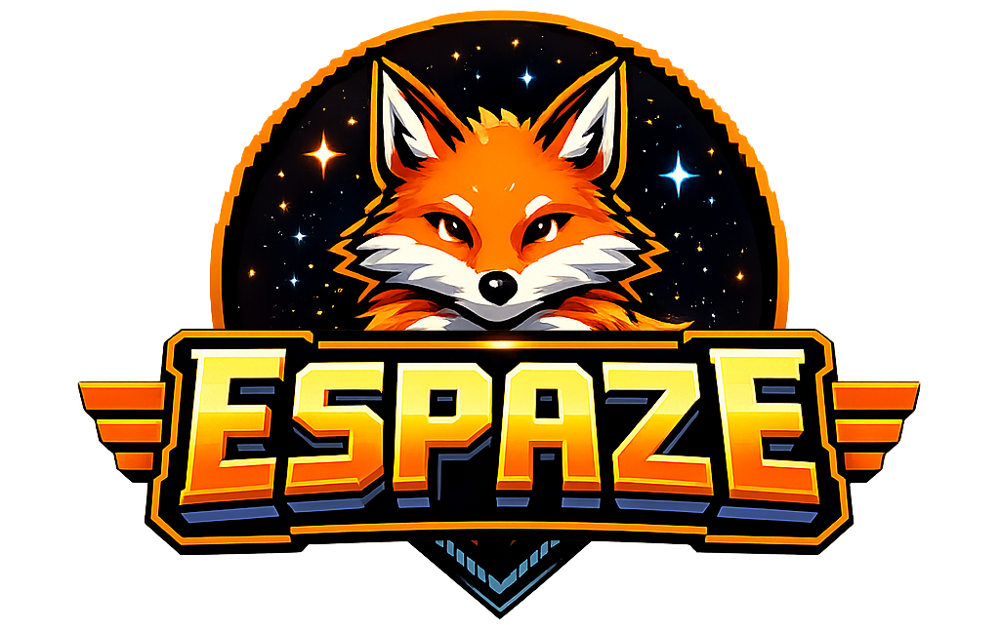

    

*A retro game launcher, with its own multi-emulators.*

 

**Espaze** is a multiplatform (Windows, macOS, Linux) retro game launcher.
 
Bundling several emulators into a single launcher.

 

## Supported systems

| System | Status | Extensions |
|---|---|---|
| CHIP-8 | ✅ Complete | `.ch8` |
| Super-CHIP | ✅ Complete | `.sc8` |
| Game Boy (DMG) | ✅ Complete  | `.gb` |
| NES | 🚧 In progress  | `.nes` |

## Tech stack

- **Backend**: [Go](https://go.dev/) + [Wails v2](https://wails.io/) (native window, Go ↔ JS bindings).
- **Frontend**: vanilla JavaScript + [Vite](https://vitejs.dev/), no framework - each view is a small module that mounts its own DOM.
- **Emulation**: homemade implementations under `internal/systems/<console>/`, all behind one common interface (`core.Core`) that lets any new console plug in without touching the rest of the app.

## Architecture

- `internal/emulation/core/core.go` - the `Core` contract every system implements.
- `internal/systems/<console>/` - one implementation per console (CPU, memory, video, sound...).
- `internal/app/app/` - the bindings exposed to the frontend via Wails.
- `frontend/src/views/` - one view per screen (library, detail, settings, player...).
